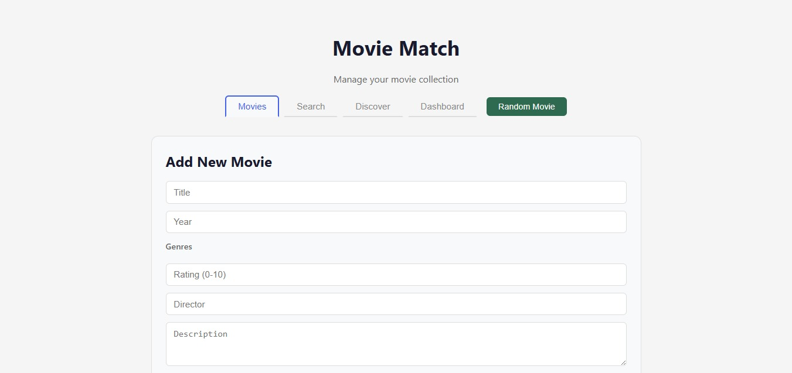

# Movie Match API

> REST API for exploring and discovering movies from the IMDb Top 250. Built with **Node.js**, **Express**, and **PostgreSQL** following a clean MVC architecture. Includes AI-powered movie recommendations via OpenRouter and a React frontend.

[](https://movie-match-ui.vercel.app)
[](https://movie-match-api.vercel.app/docs)


---

## Preview



---

## Highlights

- **AI-powered discovery** — `GET /api/movies/discover` calls OpenRouter (Llama 3.2) to return AI-enriched movie recommendations with summaries and context
- **Clean MVC architecture** — Routes → Controllers → Services → Database, with a singleton Prisma client and a centralized middleware pipeline
- **Full-text filtering** — combine genre, rating, year, and director filters with sorting and pagination in a single request
- **Nested resource design** — reviews live under `/api/movies/:id/reviews` with cascade delete when a movie is removed
- **Interactive API docs** — full OpenAPI 3.0 spec served via Swagger UI at `/docs`

---

## Table of Contents

- [Tech Stack](#tech-stack)
- [Project Structure](#project-structure)
- [API Endpoints](#api-endpoints)
- [Prerequisites](#prerequisites)
- [Local Setup](#local-setup)
- [Environment Variables](#environment-variables)
- [Available Scripts](#available-scripts)
- [License](#license)

---

## Tech Stack

| Layer | Technology |
|---|---|
| Runtime | Node.js 18+ |
| Framework | Express.js v5 |
| Database | PostgreSQL (Neon) via Prisma ORM v6 |
| AI Integration | OpenRouter API (Llama 3.2) |
| API Docs | Swagger UI + OpenAPI 3.0 |
| Frontend | React 19 + Vite |
| Module System | ES Modules (ESM) |

---

## Project Structure

```
movie-match-api/
├── prisma/
│   ├── schema.prisma          # Database schema (Movie, Review, Genre enum)
│   └── seed.js                # Seeds 30 IMDb Top 250 movies
├── docs/
│   └── swagger.yaml           # OpenAPI 3.0 specification
├── src/
│   ├── controllers/
│   │   ├── movies.controller.js    # HTTP request/response handling
│   │   └── reviews.controller.js   # Review validation and responses
│   ├── services/
│   │   ├── movies.service.js       # Movie business logic + Prisma queries
│   │   ├── reviews.service.js      # Review CRUD operations
│   │   └── ai.service.js           # AI enrichment via OpenRouter
│   ├── routes/
│   │   ├── movies.routes.js        # Movie endpoint definitions
│   │   └── reviews.routes.js       # Nested review routes (mergeParams)
│   ├── middlewares/
│   │   ├── cors.middleware.js
│   │   ├── errorHandler.middleware.js
│   │   ├── logger.middleware.js
│   │   └── notFound.middleware.js
│   └── utils/
│       └── response.js             # Consistent response format helpers
└── index.js                        # Server bootstrap
```

---

## API Endpoints

### Movies

| Method | Endpoint | Description |
|---|---|---|
| GET | `/api/movies` | List all movies (filters + sorting + pagination) |
| GET | `/api/movies/:id` | Get movie by ID (includes reviews) |
| GET | `/api/movies/random` | Get a random movie |
| GET | `/api/movies/stats` | Movie statistics by genre |
| GET | `/api/movies/genres` | Valid genre list (from enum) |
| GET | `/api/movies/discover` | AI-enriched movie recommendations |
| POST | `/api/movies` | Create a new movie |
| PUT | `/api/movies/:id` | Update a movie |
| DELETE | `/api/movies/:id` | Delete a movie (cascades reviews) |
| GET | `/docs` | Swagger UI documentation |

### Reviews

| Method | Endpoint | Description |
|---|---|---|
| GET | `/api/movies/:movieId/reviews` | List reviews for a movie |
| POST | `/api/movies/:movieId/reviews` | Create a review |
| PUT | `/api/movies/:movieId/reviews/:reviewId` | Update a review |
| DELETE | `/api/movies/:movieId/reviews/:reviewId` | Delete a review |

### Query Parameters (`GET /api/movies`)

| Parameter | Description | Example |
|---|---|---|
| `genre` | Filter by genre enum | `?genre=ACTION` |
| `minRating` | Minimum IMDb rating | `?minRating=8.5` |
| `year` | Filter by release year | `?year=1994` |
| `director` | Partial match, case-insensitive | `?director=nolan` |
| `sortBy` | Sort field: `title`, `rating`, `year` | `?sortBy=rating` |
| `order` | Sort direction: `asc` or `desc` | `?order=desc` |
| `page` | Page number (starts at 1) | `?page=2` |
| `limit` | Results per page | `?limit=10` |

### Response Format

```json
// List response
{ "success": true, "count": 10, "total": 30, "data": [...] }

// Single resource
{ "success": true, "count": 1, "data": { "id": 1, "title": "..." } }

// Error
{ "success": false, "error": "Movie not found" }
```

---

## Prerequisites

- Node.js v18+
- PostgreSQL (or a [Neon](https://neon.tech) account)
- [OpenRouter](https://openrouter.ai) API key (optional — only needed for `/discover`)

---

## Local Setup

```bash
# 1. Clone the repository
git clone https://github.com/YulianaGP/movie-match-api.git
cd movie-match-api

# 2. Install dependencies
npm install

# 3. Set up environment variables
cp .env.example .env
# Edit .env with your DATABASE_URL

# 4. Push schema and generate Prisma client
npx prisma db push
npx prisma generate

# 5. Seed the database with 30 movies
npx prisma db seed

# 6. Start the development server
npm run dev
```

Server runs at `http://localhost:3000` — API docs at `http://localhost:3000/docs`.

**To run the frontend:**

```bash
cd ../movie-match-ui
npm install
npm run dev
```

Frontend runs at `http://localhost:5173`. Both servers must be running simultaneously.

---

## Environment Variables

| Variable | Description | Required |
|---|---|---|
| `DATABASE_URL` | PostgreSQL connection string (Neon) | Yes |
| `PORT` | Server port | No (default: 3000) |
| `OPENROUTER_API_KEY` | API key from [OpenRouter](https://openrouter.ai) | No* |
| `CORS_ORIGIN` | Allowed origins for CORS | No (default: `*`) |

*Required only for the `/api/movies/discover` AI feature. The endpoint degrades gracefully without it.

---

## Available Scripts

```bash
npm start              # Start server in production mode
npm run dev            # Start server with nodemon (auto-reload)

npx prisma db push     # Sync schema with database
npx prisma generate    # Regenerate Prisma client
npx prisma db seed     # Seed database with 30 movies
npx prisma studio      # Open Prisma Studio (visual DB editor)
```

---

## License

MIT — free for personal and commercial use.
